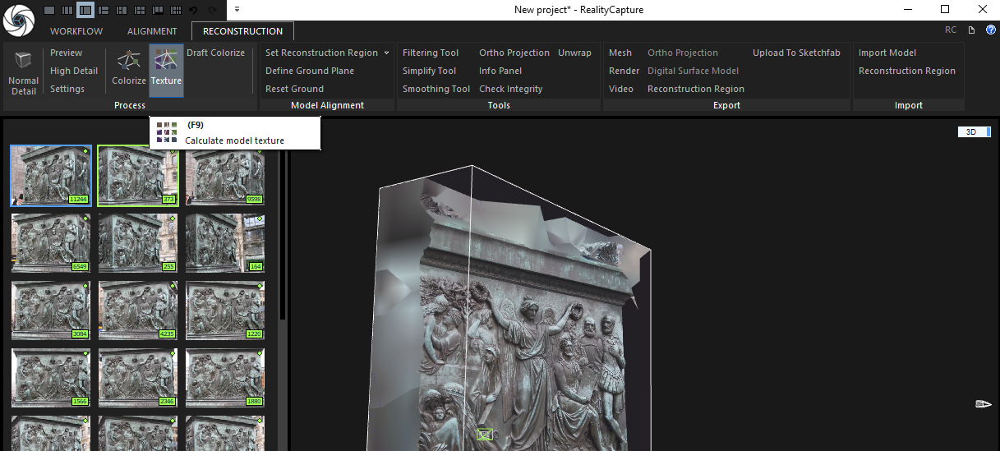
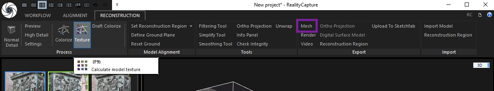
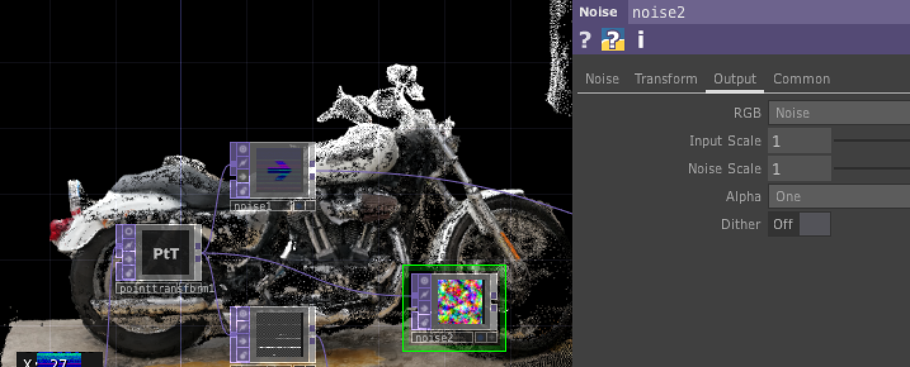
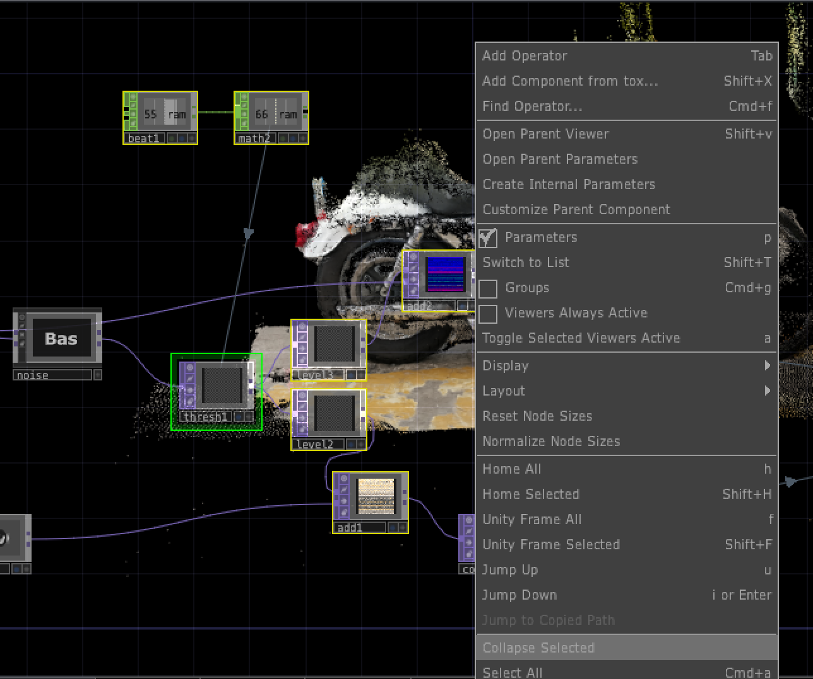

# Photogrammétrie

Workshop @ Stéréolux

b2bk@hotmail.fr

## 1. Créer un nuage de point avec des images

Choisir un objet à échelle humaine, sans trop de miroir, de verre ou de textures réflechissantes ou trop lisses.

Capturer entre 20 et 200 images, en faisant trois cercles à différentes hauteurs autour de l'objet.

Les rassembler dans un dossier.

### Utiliser RealityCapture

Dans l'onglet `Workflow`, cliquer sur `Import folder` et sélectionner le dossier contenant les images de l'objet.

Tout en haut à gauche de l'interface, sélectionner le mode deux colonnes pour voir d'un coté les images, et de l'autre la scène.

Aligner les images cliquant sur `Align Images` dans l'onglet `Alignement`, ce qui permet de voir apparaître un nuage de points plus ou moins brouillon.

Dans l'onglet `Reconstruction`, cliquer sur `Set Reconstruction Region` puis `Set Region Automatically` pour voir apparaître une boîte autour de l'objet dans le nuage de point.

Grâce aux poignées, adapter la taille de la boîte au plus proche de l'objet.

Toujours dans `Reconstruction`, cliquer sur `Normal Detail` pour créer le modèle 3D.

Une fois que le modèle est généré, cliquer sur `Texture` pour appliquer la texture calculée avec toutes les images.s

Simplifier si besoin puis re appliquer la texture.

Exporter en .xyz en retournant dans l'onglet `Alignement` puis en cliquant sur `Point Cloud`.

## 2. Mettre le nuage dans TD

Faire un TOP Point File In, et charger le nuage en .xyz

Mettre le mode en couleur pour voir la position de chaque point en RGB.

Faire un TOP Point File Select, et mettre field3, 4 et 5 dans les channels R G B.

On a des valeurs entre 0 et 255 alors qu'il veux du entre 0 et 1, donc on divise par 255 avec un TOP Math.

On crée un null position en sortie du Point File In, et un null color en sortie du Math.

On ajoute une Camera, une Light et un Geo, ainsi qu'un TOP Render.

En entrant dans le Geo, on supprime le taurus et on met un SOP Add, on coche On sur `Add Points` et on laisse en 0, 0, 0.

En sortie du Add on met un SOP Convert, dans `Convert to` on met "Particles Per Point", et dans `Particle Type` on met "Render as Point Sprites", et on coche le flag violet et bleu sur le node.

On ressort du Geo, et on active les instances, et on met le null position en `Translate OP`, en mettant r g b pour x y z.

Dans l'onglet Instance 2, on met le null color en `Color Mode` et r g b pour r g b.

Il y a normalement un nuage de points dans le TOP Render.

On crée un MAT Pointsprite, qu'on place dans `Material` dans l'onglet render du Geo. On peux modifier la taille des points avec la variable `Constant Point Scale` dans le MAT Pointsprite.

On va chercher la ArcBallCamera dans la palette, ouvrir le node et copier la camera1 dedans, et le coller dans le projet. 

Supprimer notre camera, et remplacer "cam1" dans le TOP Render par "cam2", celle qu’on a amené.

En sortant de notre projet, dans le node Project1, dans `panel`, cocher le mouse right, mouse left et mouse middle, pour pouvoir modifier la vue avec une souris 3-clics.

En sortie du TOP Render, mettre un TOP Transform et cocher `Comp over background color` pour mettre un fond en dessous du modèle.

## 2. Animer
### L'éclatement en noise

Pour pouvoir modifier les valeurs des points, en couleurs ou en position, on ajoute un TOP Point Transform en sortie du Point File In et en entrée du null position.

Ajouter un TOP noise entre le Point Transform et *position* .
Dans l'onglet Output, mettre en mode "input + noise".
Mettre l'amplitude à 0 au début, l'Offset à 0, et surtout le Monochrome en Off.
En augmentant l'Amplitude on décale donc + ou - les points de toute l'image.

Pour ne pas sélectionner tous les pixels, on peux mettre un threshold sur X, Y ou Z. On ajoute donc un TOP Threshold en sortie du Point Transform.

Pour sélectionner sur X par exemple, on prend le channel Red dans RGB. On peux ajouter du Soften pour faire un dégradé autour de la valeur qu'on met.

Ajouter un TOP add, et additionner la couleur en sortie du TOP Math et le TOP Threshold, et sortir dans le null *color* pour voir les pixels qu'on sélectionne : ici en blanc au dessus d’un certain X.

Créer un autre TOP Noise, qui sort du Point Transform, avec dans l'onglet Output le "noise" seul, et toujours en Monochrome Off.

Mettre un TOP Multiply qui croise ce noise2 et le threshold, pour avoir uniquement les couleurs du noise sur les valeurs du threshold :

On peux ainsi supprimer le TOP add et reconnecter le TOP math à la couleur :

Ajouter un TOP Add entre le Point Transform et le Multiply, afin de mettre du noise uniquement sur les pixels qu’on a sélectionné :

Pour finir, collapse en boite « noise » le thresh, noise, multiply et add.

### La vague

En sortie du node *noise*, ajouter un Threshold et choisir le channel Green pour sélectionner la position sur Y des pixels.

Sortir le Threshold dans un TOP Level, et jouer dans l’onglet RGBA pour teinter tous les pixels qui sortent du Threshold.

Sortir du Level dans un Add, dans lequel on entre également la couleur en sortie du Math, et sortir dans le null *color*.

Mettre le Threshold en mode "not equal", pour faire une ligne avec les points autour de notre valeur.

Pour monter les points sur Y, on met un Level et on fait sortir uniquement le vert, en sortant du même Threshold, et on l’Add au null *position*.

On peux aussi faire pareil avec un Channel mix, en fonction de l'intensité des valeurs de couleurs que l'on cherche.

Pour faire une vague qui se déplace, on fait un CHOP Beat, qui nous fait du 0 à 1 en mode modulo, j’ai mis la période à 12 pour faire un rythme + lent.
On le sort dans un Math pour modifier le range, ici -1, 1, à modifier en fonction de l'échelle de la scène.

Plus le soften du Threshold est grand, plus la bande est large, et plus la valeur de vert du Level est élevée, plus les pixels montent haut.

Pareil, on met tous les noeufs dans une boîte "wave".

### La limite

En la sortie du node "Wave" et le *position*, ajouter un TOP Limit, et mettre clamp en Limit Type Minimum et Maximum.

En jouant sur les valeurs soit sur la luminance (= toutes les valeurs, en cube autour de la scène), on peux ramener les pixels qui vont trop loins à une limite.

Dans l'onglet `Common` du Limit, on peux décocher des channels de couleurs dans Channel Mask pour ne pas influer sur tous les axes de position.

### Le twist

En sortie du limite, on fait un TOP Threshold sur X (Red), et on crée un nouveau TOP Point Transform, où on rotate de 1 sur X.

On rentre dans la seconde entrée avec le Threshold, qui permet de faire un masque, et dans la première entrée avec le Limit.

On crée un TOP Feedback, dont on rentre avec le Limit et on sort dans le Point Transform, et son Target TOP est le Point Transform.

On peux collapse les trois dans un node "Twist".

### La souris

Créer un CHOP Mouse In, et ajouter le bouton gauche qu’on appelle lb.

Créer un TOP Constant noir (pour l'instant).

Sortir un Null position de *wave*, et le rentrer dans le Constant juste pour lui donner la bonne taille.

Changer la couleur du Constant pour faire une couleur, ici 0, 1, 0, mais c’est arbitraire.

Faire un TOP Substract et rentrer le Constant en haut et le null *position* en bas.

Faire un Math, mettre le Substract en entrée, et mettre `combine les channels` en mode "length".

Changer le pixel format en "32 bit mono" : on a ainsi la distance en noir et blanc entre chaque pixel de l’image (x, y, z) et la coordonnée du Constant (0, 1, 0).

Rajouter un Threshold en sortie du Math, et mettre le comparateur en "greater".

Faire un Add et ajouter ça à la couleur pour voir apparaître le rond de distance de la coordonnée constant en blanc (ici j’ai changé la couleur du Constant pour trouver un truc au milieu de la moto).

Faire glisser le tx de la souris dans le rouge et le ty dans le bleu, et faire *10 pour que ça bouge d'avantage si besoin.

Après le Threshold, ajouter un Level qu’on remet en 32 bit RGBA, changer les channels couleurs et le refaire rentrer dans le Add.

Créer en sortie du Level2 un Noise, en "output" on fait juste le noise, et on le TOP Multiply avec le Threshold.

On met le Noise pas trop fort, et on Add ça à la *position*.

Après on ajoute un Constant pour faire monter sur Y ici (donc un peu de vert), et pareil on le met sur *position*.

Si on veux mettre le particle machin, on fait rentrer position et couleur, et sortir position et couleurs.

Pour sortir une video, en sortie du out mettre un movie file out.
On décoche realtime, on fait record et au bout d’un moment on arrête le record.

Cocher autorotate dans archball dans la camera pour que la camera tourne autour.

